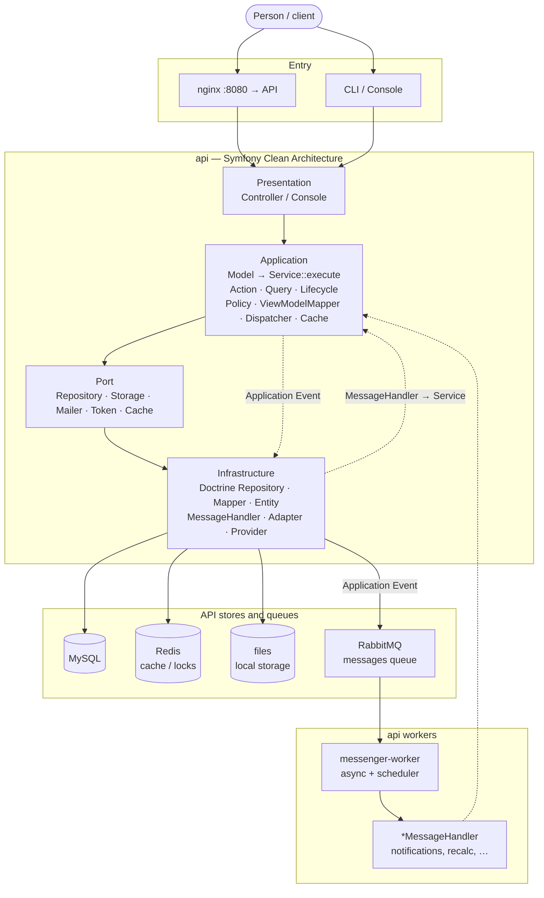

# cln-arch-sym-simple

Local monorepo. Two directories at the root:

| Directory | Purpose |
|-----------|---------|
| [`api/`](api/README.md) | Main Symfony API (MySQL, JWT, business logic) |
| [`docker/`](docker/README.md) | Docker Compose for local development (nginx, PHP, database, workers) |

---

## How the project works (from the user to the data)

### In short

1. A **person** hits `nginx` (`:8080` — API) or runs Console.
2. **Presentation** builds a request `*Model` (`fromArray`) and calls `*Service::execute`. Console parses the CLI and calls a Lifecycle `*Service`.
3. **Application**: Policy → persistence `*Model` → Port. Action / Query return only a response `*ViewModel` | list | page | void. After a write, Lifecycle updates the cache and publishes an Application Event (`*Dispatcher`).
4. **Infrastructure** implements Port: MySQL (Doctrine), Redis, files. The Application Event goes to the RabbitMQ `messages` queue.
5. **messenger-worker** reads the queue: `*MessageHandler` calls an Application `*Service` (notifications, recalc). The same worker runs the scheduler.

Layer conventions: [`api/src/Application/CLAUDE.md`](api/src/Application/CLAUDE.md), [`api/src/Infrastructure/CLAUDE.md`](api/src/Infrastructure/CLAUDE.md).
